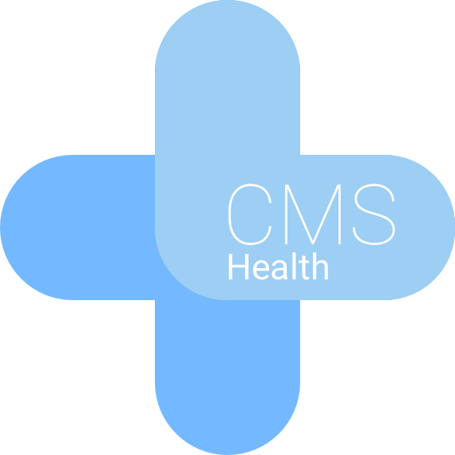

# CMS Health Project

This project aims to provide a standardized way for content management systems and services to expose their health status, making it easier for monitoring tools, load balancers, and other infrastructure components to understand and react to the health of these services.

## Project Members 2025
### Lead
* [Oliver Bartsch](https://github.com/o-ba)
### Members 
* [Remkus de Vries](https://github.com/remkus)
* [Timo Feuerstein](https://github.com/tfeuerst)
* [Thomas Stauer](https://github.com/tstauer)
* [Benni Mack](https://github.com/bmack)
* [Bernd Stellwag](https://github.com/burned42)
* [Patrick Koppe](https://github.com/Patrick-Koppe)
* [Ephraim Härer](https://github.com/Kephson)

## Project Members 2024
### Lead
* Nils Langner - Founder “startwind”
### Members 
* [Justin Joe Kostka](https://github.com/jujoko7CF)
* [Marc Nilius](https://github.com/zottto)
* [Mike WP Bullet](https://github.com/wpbullet)
* [Oliver Bartsch](https://github.com/o-ba)
* [Stefan Buerk](https://github.com/sbuerk)
* [Thomas Bruehl](https://github.com/00Sleepy)

## Hashtags
#PHP #TYPO3 #Drupal #WordPress #Joomla #HealthCheck #Monitoring #Availability

## Project Description
In the realm of application hosting, uptime monitoring has always been the traditional approach to safeguard websites and e-commerce stores. While this is indeed efficient and straightforward, the increasing complexity of modern applications makes this method inadequate in professional settings. 

To address this flaw in modern application operation, our focus extends beyond mere uptime monitoring to encompass the true vital aspects of an online application, such as updates, user management, shop orders, and other crucial health metrics. The lack of functionality in parts of an application can often go unnoticed with standard monitoring practices.

The project aims to collect, analyze, and provide additional data from websites with a better understanding of their health to the respective operator. The website operator or hosting company is often expected to keep the overview, but the absence of a standardized format for health checks across the manifold CMS landscape makes this a hard challenge to solve.

## Hackathon Goals
In this hackathon, we want to jointly develop a health check format that works for open-source systems like Drupal, TYPO3, Joomla!, WordPress, and frameworks. The initial phase will involve the ideation and development of a standardized format for the CMS health checks, that accommodates the unique requirements of different open-source systems and offers flexibility and extensibility. Additionally, we’re aiming to have the first basic implementation for the participating CMS systems in place that can report basic health data in a secure and privacy-friendly way.

## Target Audience
Developers, SysOps, administrators, CMS contributors, agencies and more.

## Ressources
* [IETF Health Check Response Format for HTTP APIs](https://datatracker.ietf.org/doc/html/draft-inadarei-api-health-check#name-example-output)
* [CloudFest Hackathon 2024 Project Page](https://hackathon.cloudfest.com/project/cms-health-checks/)

